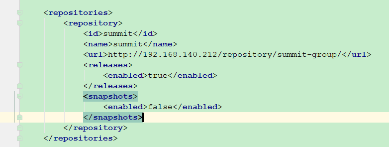
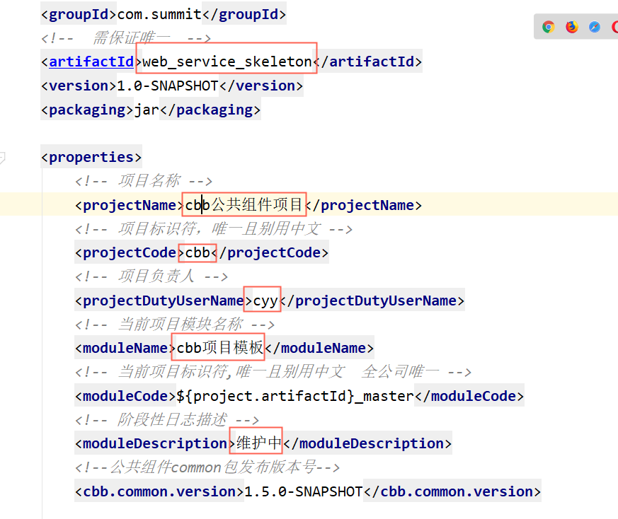
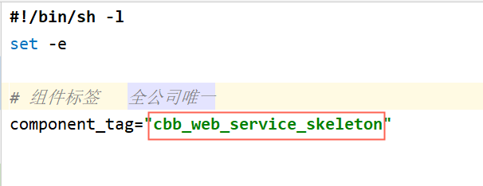
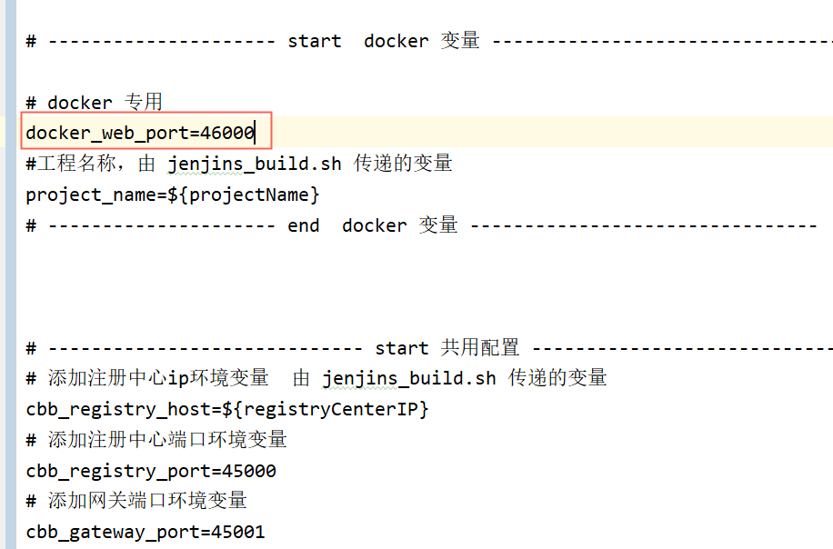
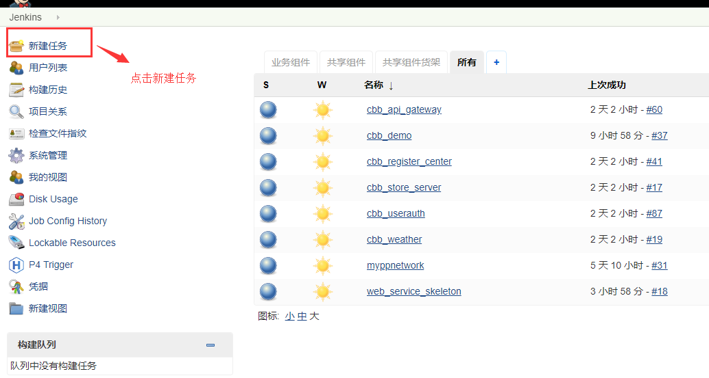
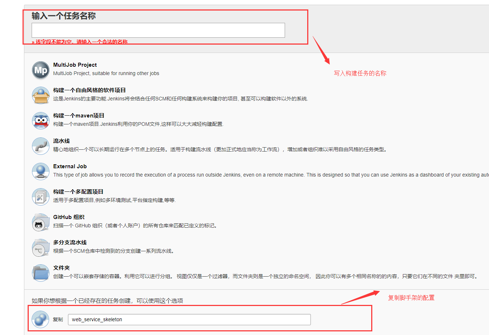
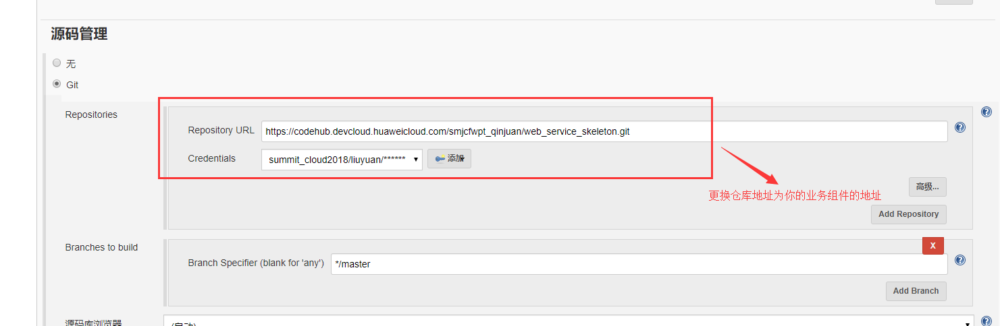
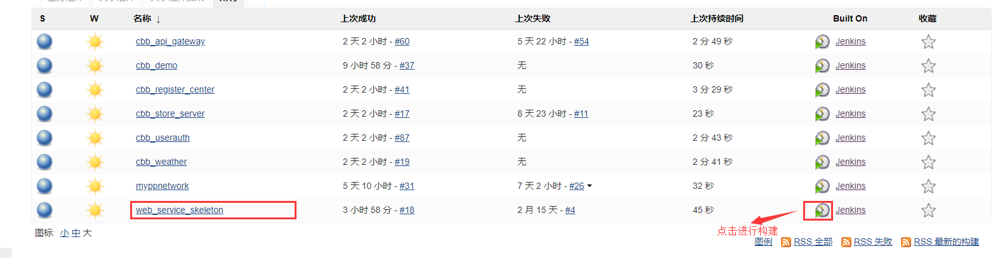
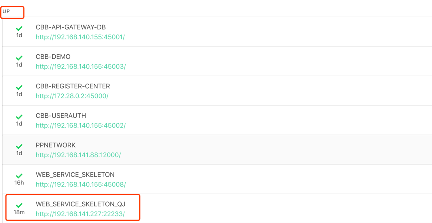
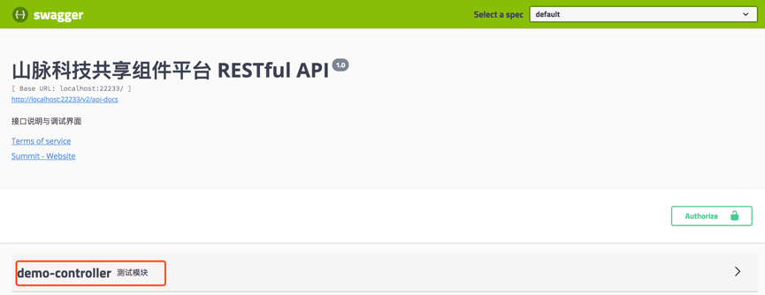

# 山脉科技业务组件脚手架

[TOC]

## 开发环境
- git
- jdk 1.8+
- maven 3.2+
- redis 3.2+
- mysql 5.7+
- IDE Idea&Eclipse
- lombok

## 工程结构
```
web_service_skeleton
├── deploy    --部署生产环境相关脚本目录
├── src       --源码目录
│ └── main
│         ├── java
│         │    └── com.summit
│         │         └── MainAction.java --骨架启动类
│         └── resources
│              ├── db                    --管理的sql脚本
│              ├── application.yml       --公共变量配置文件
│              ├── application-dev.yml   --开发环境配置文件
│              ├── application-prod.yml   --生产环境配置文件
│              └── logback.xml           --日志配置文件
│               └── mybatis-config.xml    --mybatis配置文件
├── .dockerignore    -- 构建Docker镜像时复制文件的忽略文件清单
├── Dockerfile       -- 构建Docker镜像脚本
└── pom.xml          -- maven配置文件
```

## 关于依赖共享组件common包的注意事项:

- 共享组件common包所在的maven中央仓库地址如下图：开发脚手架已经在pom中配置完成，下图仅供参考：

    

## 组件名称命名规范

- 配置组件中的`application.yml`配置文件:

- 组件名称以`cbb-`开头，后缀以具体组件的用途的英文全拼或缩写命名，注意：用缩写的前提是必须是有明确意义的缩写

``` yml
  spring:
      application:
        name: "cbb-web-service-skeleton" -- 分隔符必须用'-'
```


## 业务组件如何发布到货架

- 在项目pom 中，配置如图：


- **方式一**  手动推送   mvn clean install   执行后，mvn com.summit:cbb_maven_software:push 或者在idea 插件中双击
- **方式二**  加入jekins 构建，脚本自动推送。


## 关于如何加入jekins构建:

- 需要修改如图红色框内容部分：
  在你的组件中的`deploy/jenkins_build.sh`文件中，如图：

  

  在你的组件中的 deploy/.env 文件中修改需要的配置及端口，如下图：
  
  
  
  
  
- 每个业务组件需要在`192.168.140.155:6333`这台服务器的CI系统上创建一个自己的构建任务,创建构建任务的步骤：
  - 第一步：
    
  - 第二步，复制脚手架配置，然后点击确定：
    
  - 第三步,更换仓库地址,然后点击保存：
    

- 如下图创建的是一个业务组件脚手架的构建任务：

    

## 开发流程

### 切换环境

- 切换到开发环境模式配置文件，需要配置组件中的`application.yml`配置文件
    ``` yml
    spring:
      profiles:
        active: dev
    ```
- 修改应用程序的名称
    ``` yml
    spring:
      application:
        name: "web-service-skeleton" --此处用应用程序开发模板作为例子
    ```
  备注：为了防止在开发环境中的冲突问题，应用程序的名称做个规定:项目名称_自己名字缩写，比如：<font color=#FF0000>web-service-skeleton-qj</font>

### 编译

``` shell
  cd web_service_skeleton

  mvn clean install
```

构建完成，生成target目录，目录结构如下图

```
   target
   ├── classes
   ├── config      -- 配置文件打包的位置
   ├── generated-sources
   ├── lib         -- 打包之后所依赖的jar包
   ├── maven-archiver
   ├── maven-status
   └── backend.jar  --打包后的jar包
```

### 启动

- 运行 `MainAction.java` 即可

- 启动完成后访问<http://192.168.140.155:45000/admin>，用户名和密码为：

  ``` yml
      用户名:ucp
      密码:Summit2018
  ```

- 在访问页面出现注册的服务为<font color=green size=5px> up</font>，即启动成功，如下图所示：

  

- 访问<http://localhost:22233/swagger-ui.html>，即可调试接口,如下图所示

  或者使用 <http://localhost:22233/doc.html>
  
  

### 开发

#### 配置文件

- 将`application-dev.yml`的数据库切换为自己的业务库

  ```yml
  spring:
    datasource:
      driver-class-name: com.mysql.jdbc.Driver
        jdbc:mysql://192.168.140.155:49999/web_service_skeleton?createDatabaseIfNotExist=true&useSSL=false&useUnicode=yes&characterEncoding=UTF-8
        username: root  --用户名
        password: Summit2017 --密码
  ```

- 开发环境和线上环境一致的属性配置在`application.yml`中，开发环境和线上环境不一致的属性配置在`application-dev.yml`和`application-pro.yml`中

#### 代码生成

```
代码生成依赖 springboot + mysql 自主集成。根据数据库自动生成.
为了有一个良好的注释，请在生成代码之前，给数据表字段和数据库表添加注释。
访问路径(当前项目ip和端口) http://ip:port/generate/list

```


#### 源码

```
com.summit
 ├──config                   -- 配置类所在包
 ├──content                 -- 业务层
 |     ├── user              -- 业务模块，如用户模块
 |     |    ├── mapper            -- 持久层所在包
 |     |    ├── service           -- 业务层所在包
 |     |    ├── controller        -- 控制层所在包
 |     |    ├── model             -- dto所在包
 |     |    ├── entity            -- 实体所在包
 └── MainAction.java         -- 核心启动类
```

## 部署

### 访问货架
> <192.168.140.155:8080>
### 中间件下载地址
> <http://192.168.140.155:60000/>  用户名密码   amin/Summit123
文件地址：  /home/publicfile/html/doc/

